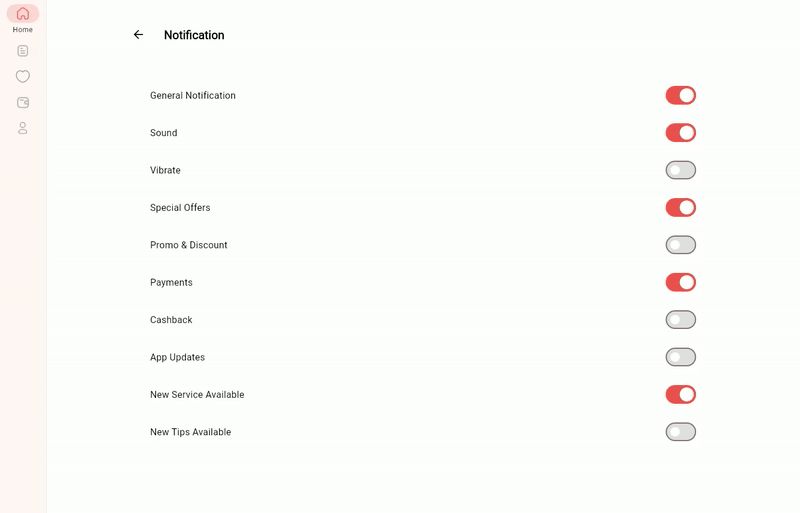
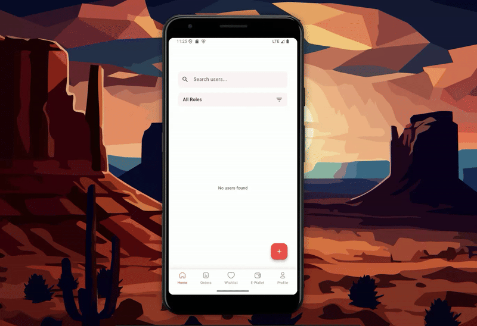

# 🚀 Flutter Quest App

Welcome to the **Flutter Quest App**, a mini multi-day challenge designed to level up your Flutter UI/UX skills! This project features authentication screens, user settings, and modern UI/UX practices like dark mode, animations, and custom fonts.

---

## 📽️ Large Screen Demo



---
## 📽️ Small Screen Demo



---

## 🗓️ Challenge Timeline

| Day | Quest                   | Description                                                                                         |
|-----|-------------------------|-----------------------------------------------------------------------------------------------------|
| 1   | Sign Up & Sign In       | Build responsive login & register UI with error handling and input validation                      |
| 2   | User Profile + Settings | Create a profile page with editable name/image/email and a settings screen (dark mode, change password) |
| 3   | User Panel (UI Only)    | Display a user list in grid/table view with search/filter by role, and mock suspend/edit/delete actions |

---

## 🎯 Mini Quests (Optional Add-ons)

| Task                        | Description                                |
|----------------------------|--------------------------------------------|
| 🌗 Dark Mode Toggle         | With icon                                  |
| ⏳ Loading Animation        | Lottie/Spinner                             |
| 🧑‍🎤 Avatar Upload UI       | Upload and preview profile picture         |
| 🔤 Custom Fonts Integration | Use custom fonts to personalize UI         |
| 🎞️ UX Animations           | Fade/page transitions, interactive effects |

---

## 🧰 Tech Stack

- Flutter
- Dart
- [Lottie](https://pub.dev/packages/lottie)
- Shared Preferences / Provider / Riverpod

---

## 📦 Setup Instructions

1. Clone the repo:
   ```bash
   git clone https://github.com/DereckGeorge/nguvutech.git
   cd flutter-quest-app
   flutter pub get
   flutter run

